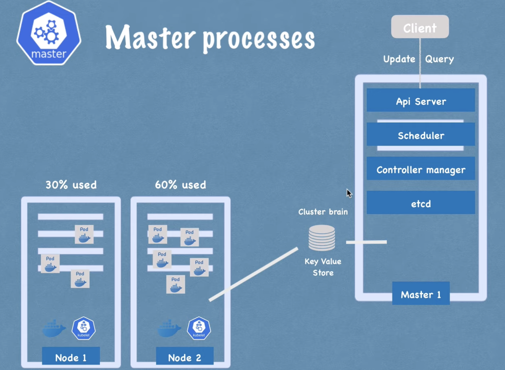

# Architecture

## some points 
- Each node has multiple Pods on it
- 3 processes must be installed on every node
- Worker Nodes do the actual work
- Each Node should have container runtime, Kubelet, KubeProxy

## Kubelet
- Interacts with both the container and Node
- Starts the pod with a container inside
- All node should have kubelet and container runtime and kubeProxy

## KubeProxy
- forwards the requests to PODS
- Has intelligent forward logic to transfer logic to right POD and in most optimized way

Kubernetes works on master and worker node architecture.
- Scheduling, adding, deleting, restarting node or Pod is taken care by master node
4 services run on master node
1. API server - cluster gateway, update or query, acts as gatekeeper. Any request will talk to API server 
some request -> API server -> validates requests -> other process
2. Scheduler - 
schedule new pod -> API server -> scheduler -> where to put the POD?
Try to balance the load accross multiple nodes
3. Controller manager - Checks health of the cluster
- detects changes in the state 
- when a pod dies it requests scheduler to lauch another POD
4. etcd - cluster brain (cluster changes are stored key value store)
- Stores relevant data that helps master processes to manage worker processes

