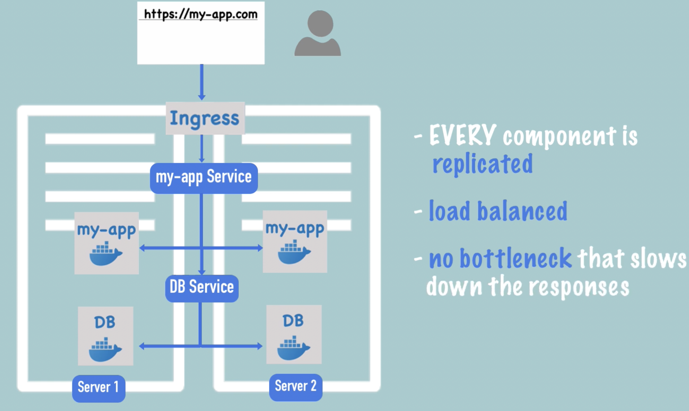

# Kubernetes is orchestration tool
- It provides high availablity
- Scalability 
- disaster recovery

- From request to return every component is replicated and load balanced. No bottlenect that slows down the response.

# Disaster recovery
- Done by taking backing up snapshot of etcd in remote storage
