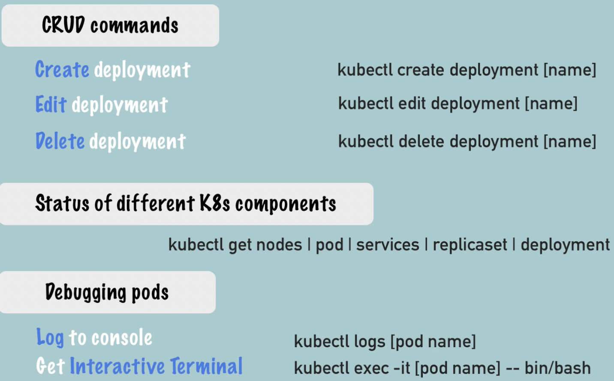
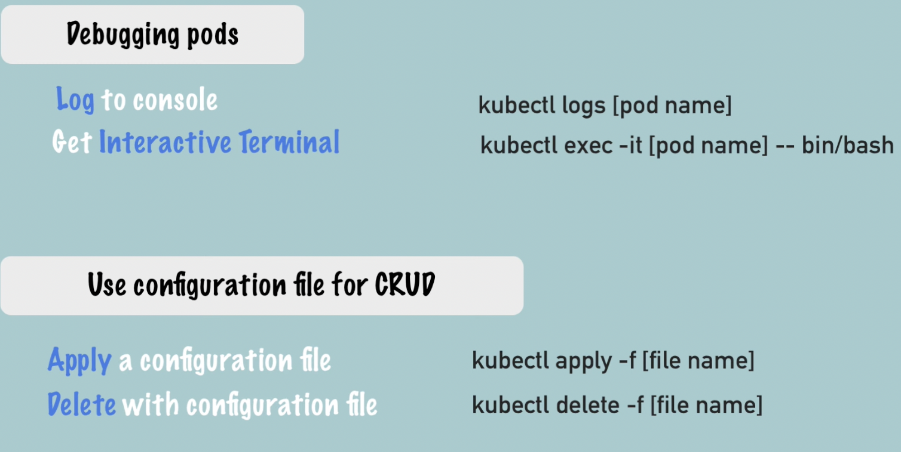

# Kubectl commands
- POD is smallest unit in K8 cluster. But won't be dealing with POD at all.
- In K8 deployment is abstraction over Pods

kubectl create deployment nginx-deployment --image=nginx
- blueprint for creating pods
- most basic configuration for deployment

replicaset is managing replics of a pod

## Layers of Abstraction
- Deployment manages a replicaset which manages Pod which is an abstraction of container

## Commands

