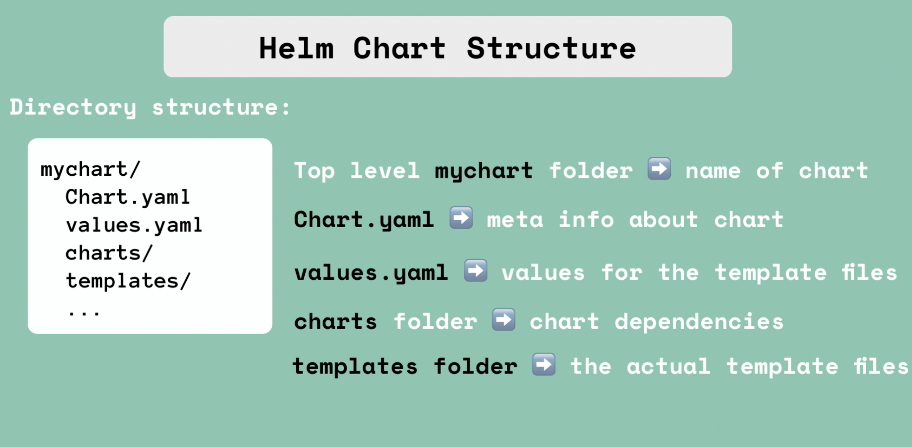
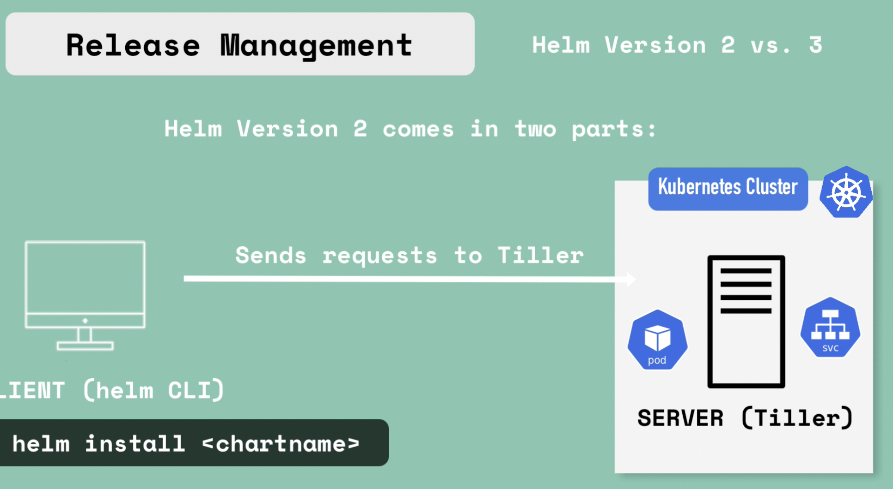
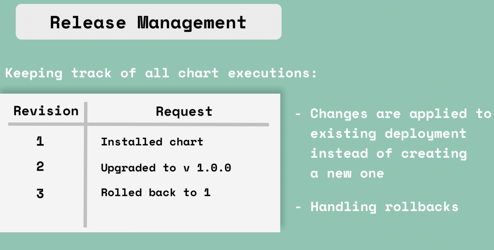

# Kubernetes
- Smallest unit of K8
- Pod is abstraction of container
- Usually 1 container is run in 1 pod but helper containers can also be clubbed
- Each pod gets it's own IP address

## Service
- Permanent IP address
- Could be internal service and external service
- Lifecycle is independent of PODs
- Service is common across Nodes
- Also acts as load balancer to redirect requests to free nodes

## Ingres
- Sort of external services which takes in the request from external applications
- Ingress servie would also be running on their own POD in each node

## ConfigMap (helps to avoid rebuiding when something like db service has changed)
- External configuration of application like DB_URL=mongo-db-service

## Secret
- Just like configMap for username and password

## Volues
- For data persistant
- External storage outside container/POD
- It could be storage of local or remote storage

## Deployments
- Blueprint for PODs

## statefulset
- Database can't be replicated because DBs have state to maintain  
which should be resolved using another service called statefulset
- Sync is bit tricky

## PS
- Usually stateless applications are hosted in K8 cluster and other stateful applications are hosted outside K8 cluster

## Namespace
- Organise resouce in namespaces
- They are basically virtual resource containers
- Best practices in using namespaces
1. Resources grouped in Namespaces
2. Conflict: Many teams, same applications
3. Resource sharingl staging and development | Blue/Green deployment(v1 prod and v2 prod)
4. access and resource limits on Namespaces

You can't access most resources from another namespace ex: configmap and secretes

shareable services: databases and services

Untagged components: volumes and nodes

## ingress
- For securve external connection
- Need not open internal ip and port outside the cluster
-- In order for it work you need to install ingress controller pod, that just evaluates the rules in the config file, manages redirections, entrypoint to cluster. K8 has got it's own ingress controller

# Helm
- Package manager for Kubernetes
- Bundle of YAML files are Helm charts
- These helm charts are availabe in helm repository
- Could be shared across teams and organizations
- all the configurations names could be stored in helm and deployed seperately by just changing those names as per needs
- same applications could be deployed acroos different envrironments using same yaml files but different helm config/charts

- Downside of helm
 As tiller has too much power inside of K8s cluster, vulnerable to security threats. So it was removed in helm 3
