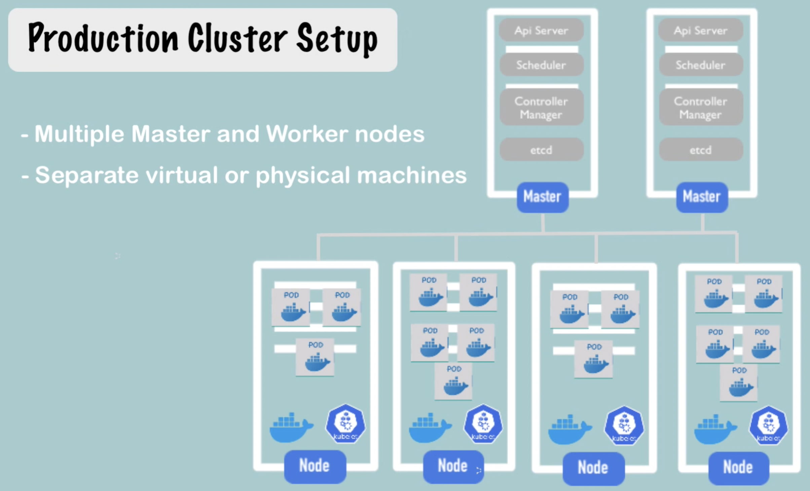
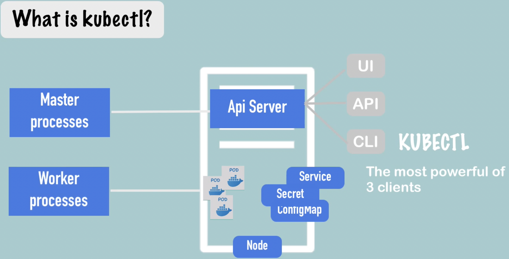

## Production setup

# to test locally - MiniKube
- We have minikube which has everything needed
- creates virtual box in laptop
- Node runs in virtual box
- 1 node k8 cluster
- for testing purpose
- to interact with minikube we have kubectl

# Running following commands
- brew install minikube
-- with this minikube and kubectl would be installed. No need of vm hyperkit to work with minikube.
- minikube start --driver=docker => To start minikube server 
- kubectl get nodes

kubectl CLI for configuring the minikube cluster
minikube for start up/deleting the cluster